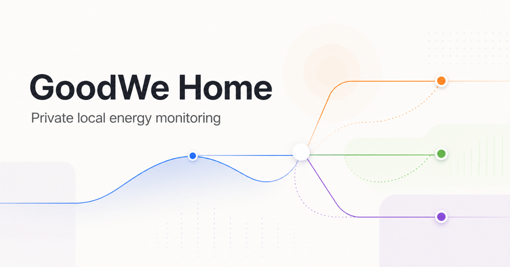

# GoodWe Home

A modern, self-hosted dashboard for monitoring a GoodWe solar inverter directly over your local network.

[](LICENSE)
[](https://github.com/AbdullahSaad5/goodwe-home-dashboard/actions/workflows/ci.yml)


GoodWe Home shows live production, household demand, battery activity, and grid exchange without sending telemetry to a cloud service.

It is read-only by design. The dashboard never changes inverter settings, operating modes, battery limits, or export controls.



> [!NOTE]
> This is an independent community project and is not affiliated with or endorsed by GoodWe Technologies Co., Ltd.

## Highlights

- Live Solar → Home ↔ Battery ↔ Grid power-flow visualization
- Animated values and directional arrows driven by real telemetry
- Automatic inverter discovery with a persistent last-known address
- Day, week, month, and year energy charts with date navigation
- Solar, MPPT, battery, BMS, grid, load, and system diagnostics
- Local event history, searchable raw sensors, and CSV export
- Responsive desktop, tablet, and mobile interface
- SQLite history with no external database or cloud dependency
- Coordinated Server-Sent Events keep live cards, charts, summaries, sensors, and events in sync
- Interactive chart zoom is preserved while refreshed points arrive
- Operational 15-minute to 24-hour trends with outage shading and table mode
- Optional calibrated solar forecast, learned load profile, and 24-hour SOC projection
- Debounced outage history, timestamped daily peaks, records, and advisory watchdogs
- Persistent light/dark appearance with first-visit system preference and a light or dark full-screen wall mode
- Opt-in foreground desktop notifications

## Quick start

### Requirements

- Python 3.11 or newer
- Node.js 22.13 or newer
- A supported GoodWe inverter on the same LAN

### Install and run

```bash
git clone https://github.com/AbdullahSaad5/goodwe-home-dashboard.git
cd goodwe-home-dashboard
./setup.sh
./start.sh
```

Open [http://localhost:8080](http://localhost:8080). Other devices on the same network can use `http://<computer-ip>:8080`.

The dashboard is intended for trusted local networks. Do not expose port 8080 or the inverter directly to the public internet.

## Inverter discovery

No inverter IP address is built into the project.

On startup, the collector follows this order:

1. Try `GOODWE_HOST` when explicitly provided.
2. Try the last working address saved in SQLite.
3. Use the GoodWe LAN discovery broadcast.
4. Check the active local `/24` network on the configured inverter port.
5. Validate the responder as a supported GoodWe inverter.
6. Replace the saved address when the inverter moves.

After the first successful discovery, later launches normally connect directly to the saved address without scanning.

## Configuration

Configuration is supplied through environment variables. Every setting is optional.

| Variable                | Default               | Purpose                                             |
| ----------------------- | --------------------- | --------------------------------------------------- |
| `GOODWE_HOST`           | Automatic             | Optional inverter address override                  |
| `GOODWE_PORT`           | `502`                 | Local inverter communication port                   |
| `POLL_INTERVAL_SECONDS` | `10`                  | Live telemetry polling interval                     |
| `STALE_AFTER_SECONDS`   | `30`                  | Age before readings are marked stale                |
| `DASHBOARD_TIMEZONE`    | `Asia/Karachi`        | Calendar boundaries and reporting timezone          |
| `DATABASE_PATH`         | `data/goodwe.sqlite3` | Local SQLite database path                          |
| `STATIC_DIR`            | `web/dist`            | Built frontend directory                            |
| `PORT`                  | `8080`                | Dashboard web-server port                           |
| `BATTERY_CAPACITY_KWH`  | Unconfigured          | Enables reserve energy, runtime, and SOC projection |
| `BATTERY_RESERVE_PCT`   | `20`                  | Reserve floor used by the projection                |
| `INVERTER_RATED_W`      | Unconfigured          | Enables live inverter utilisation                   |
| `SITE_LATITUDE`         | Unconfigured          | Enables opt-in weather forecasting                  |
| `SITE_LONGITUDE`        | Unconfigured          | Enables opt-in weather forecasting                  |
| `PV_ARRAY_KWP`          | Unconfigured          | Converts forecast irradiation to PV energy          |
| `PV_TILT_DEG`           | Unconfigured          | Optional panel tilt for tilted irradiance           |
| `PV_AZIMUTH_DEG`        | Unconfigured          | Optional panel azimuth for tilted irradiance        |

Example:

```bash
DASHBOARD_TIMEZONE=America/Toronto PORT=8080 ./start.sh
```

## Dashboard sections

| Section      | Contents                                                                                                              |
| ------------ | --------------------------------------------------------------------------------------------------------------------- |
| Overview     | Command-center health, live flow and mix, operational trends, projections, forecasts, outages, records, and watchdogs |
| History      | Anchored day, week, month, and year charts with CSV export                                                            |
| Solar        | PV production, MPPT voltage, current, power, and operating state                                                      |
| Battery      | SOC, SOH, voltage, current, temperatures, cell spread, limits, and BMS details                                        |
| Grid & Loads | Import/export, voltage, frequency, apparent power, reactive power, and meter state                                    |
| System       | Inverter health, firmware, clocks, temperatures, registers, and local events                                          |
| Raw Data     | Searchable access to every sensor returned by the inverter                                                            |

Use the sun/moon control in the header to switch appearance. The dashboard follows the browser or operating-system preference on first visit, then stores an explicit choice in that browser. The selected appearance also applies to charts, menus, the connecting experience, responsive navigation, and wall mode.

## Data storage

By default, application data stays in `data/goodwe.sqlite3`, which is excluded from Git.

- Core telemetry is sampled every 10 seconds by default.
- Complete raw snapshots are retained once per minute.
- Core samples and raw snapshots are retained for 30 days.
- One-minute aggregates are retained for one year.
- Longer-term 15-minute and daily aggregates are retained indefinitely.
- Daily records, timestamped peaks, and confirmed outage summaries are retained indefinitely.
- Successful forecast runs are cached for 60 days; a failed refresh never interrupts collection.
- The last working inverter address is saved in the same database.

The first schema upgrade creates a one-time `*.pre-command-center.bak` SQLite backup before changing the database. Missing historical MPPT or temperature values remain null.

SQLite runs in WAL mode so the dashboard can read history while the collector writes new samples.

## API

Every dashboard API endpoint is read-only.

| Endpoint                     | Purpose                                      |
| ---------------------------- | -------------------------------------------- |
| `GET /api/v1/health`         | Collector health and active inverter address |
| `GET /api/v1/status`         | Latest normalized snapshot                   |
| `GET /api/v1/history`        | Time-series history for a selected period    |
| `GET /api/v1/summary`        | Aggregated energy and availability metrics   |
| `GET /api/v1/sensors`        | Latest raw sensor readings                   |
| `GET /api/v1/events`         | Local collector and inverter events          |
| `GET /api/v1/command-center` | Presentation-ready operational intelligence  |
| `GET /api/v1/export.csv`     | CSV export for a selected period             |
| `GET /api/v1/stream`         | Live snapshot stream over SSE                |

History, summary, and export requests accept `period=day|week|month|year` and an optional `anchor=YYYY-MM-DD`.

Command Center accepts `range=15m|1h|3h|6h|12h|24h` and `history=14d|30d|60d|12m`. CSV export accepts `dataset=telemetry|daily`; telemetry remains the default.

Battery power is positive while discharging and negative while charging. Grid power is positive while exporting and negative while importing.

## Live refresh behavior

The collector broadcasts each new inverter snapshot over Server-Sent Events. The interface applies the snapshot immediately, then refreshes Power Trends, calendar history, summaries, raw sensors, events, and Command Center intelligence as one coordinated cycle. A 60-second fallback refresh keeps those datasets current if the live stream is temporarily interrupted.

Refreshing data does not reset an active chart zoom. Changing a trend range, history period, or anchor date intentionally opens the new selection at its full extent.

## Architecture

- **Collector:** Python and `goodwe` read local inverter telemetry.
- **Storage:** SQLite stores snapshots, aggregates, events, and the last working address.
- **API:** FastAPI exposes read-only JSON, CSV, and SSE endpoints.
- **Interface:** React, TypeScript, Vite, ECharts, Motion, Radix UI, and Tailwind CSS.

The browser communicates only with the local FastAPI service. It does not connect directly to the inverter.

The source is separated by runtime boundary:

- `server/src/goodwe_home/` contains the installable Python package.
- `server/tests/` contains backend tests.
- `web/src/` contains the React application and frontend tests.
- `docs/` contains deeper technical documentation.

See [Architecture](docs/architecture.md) for module responsibilities, data flow, and extension guidance.

## Development

Install dependencies once:

```bash
./setup.sh
```

Run the backend and frontend development servers in separate terminals:

```bash
.venv/bin/uvicorn goodwe_home.main:app --host 0.0.0.0 --port 8080
```

```bash
npm run dev
```

Run the checks before submitting changes:

```bash
make format
make lint
make test
make build
```

See [Contributing](CONTRIBUTING.md) for the complete development workflow and pull request expectations.

## Security and privacy

- Inverter communication is read-only.
- No inverter credentials or IP addresses are committed to Git.
- Telemetry and history stay on the local machine.
- When forecasting is enabled, site coordinates—but never inverter telemetry—are sent to Open-Meteo.
- Desktop notifications are foreground-only and require localhost or HTTPS; in-app alerts remain available everywhere.
- The SQLite database and environment files are ignored by Git.
- No configuration or control endpoints are exposed.

Review your network rules before running the server on an untrusted or shared network.

## License

Released under the [MIT License](LICENSE).

Please read the [Code of Conduct](CODE_OF_CONDUCT.md) and [Security Policy](SECURITY.md) before participating or reporting a vulnerability.
